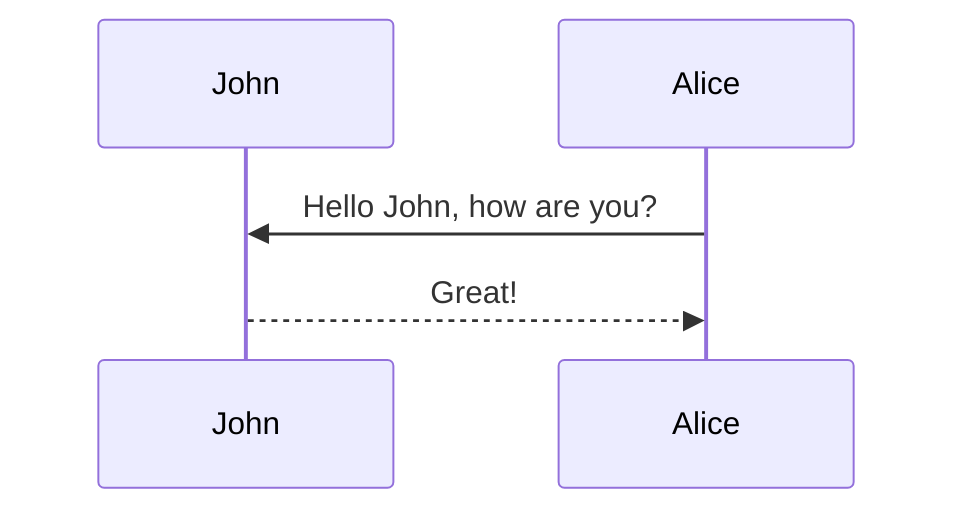

# Tabs

This is how a post with [tabs](https://github.com/Ovski4/jekyll-tabs) looks like. Note that the tabs could be used for different purposes, not only for code.

## Example 1

To add tabs, use the following syntax:



```liquid




Content 1





Content 2




```



With this you can generate visualizations like:





```php
var_dump('hello');
```





```javascript
console.log("hello");
```





```javascript
pputs 'hello'
```





## Example 2





```yaml
hello:
  - "whatsup"
  - "hi"
```





```json
{
  "hello": ["whatsup", "hi"]
}
```





## Tabs for Text Style





Regular text





> A quote





Hipster list

- brunch
- fixie
- raybans
- messenger bag





# Tables

Using markdown to display tables is easy.

## Simple

First, add the following to the post's front matter

```yml
pretty_table: true
```

Then, the following syntax

```markdown
| Left aligned | Center aligned | Right aligned |
| :----------- | :------------: | ------------: |
| Left 1       |    center 1    |       right 1 |
| Left 2       |    center 2    |       right 2 |
| Left 3       |    center 3    |       right 3 |
```

will generate

| Left aligned | Center aligned | Right aligned |
| :----------- | :------------: | ------------: |
| Left 1       |    center 1    |       right 1 |
| Left 2       |    center 2    |       right 2 |
| Left 3       |    center 3    |       right 3 |

<p></p>

## HTML

It is also possible to use HTML to display tables. For example, the following HTML code will display a table with [Bootstrap Table](https://bootstrap-table.com/), loaded from a JSON file:



```html
<table id="table" data-toggle="table" data-url="{{ '/assets/json/table_data.json' | relative_url }}">
  <thead>
    <tr>
      <th data-field="id">ID</th>
      <th data-field="name">Item Name</th>
      <th data-field="price">Item Price</th>
    </tr>
  </thead>
</table>
```



<table
  data-toggle="table"
  data-url="{{ '/assets/json/table_data.json' | relative_url }}">
  <thead>
    <tr>
      <th data-field="id">ID</th>
      <th data-field="name">Item Name</th>
      <th data-field="price">Item Price</th>
    </tr>
  </thead>
</table>

<p></p>

## More Complex

By using [Bootstrap Table](https://bootstrap-table.com/) it is possible to create pretty complex tables, with pagination, search, and more. For example, the following HTML code will display a table, loaded from a JSON file, with pagination, search, checkboxes, and header/content alignment. For more information, check the [documentation](https://examples.bootstrap-table.com/index.html).



```html
<table
  data-click-to-select="true"
  data-height="460"
  data-pagination="true"
  data-search="true"
  data-toggle="table"
  data-url="{{ 'https://github.com/anmmashud/ai_quest_ML/blob/main/Assignments/3/Dhaka_Rent.csv' | relative_url }}"
>
  <thead>
    <tr>
      <th data-checkbox="true"></th>
      <th data-field="id" data-halign="left" data-align="center" data-sortable="true">ID</th>
      <th data-field="Area" data-halign="center" data-align="right" data-sortable="true">Item Name</th>
      <th data-field="Rent" data-halign="right" data-align="left" data-sortable="true">Item Price</th>
    </tr>
  </thead>
</table>
```



<table
  data-click-to-select="true"
  data-height="460"
  data-pagination="true"
  data-search="true"
  data-toggle="table"
  data-url="{{ '/assets/json/table_data.json' | relative_url }}"
>
  <thead>
    <tr>
      <th data-checkbox="true"></th>
      <th data-field="id" data-halign="left" data-align="center" data-sortable="true">ID</th>
      <th data-field="item" data-halign="center" data-align="right" data-sortable="true">Area</th>
      <th data-field="price" data-halign="right" data-align="left" data-sortable="true">Rent</th>
    </tr>
  </thead>
</table>


```html
<table
  data-click-to-select="true"
  data-height="460"
  data-pagination="true"
  data-search="true"
  data-toggle="table"
  data-url="{{ '/assets/json/table_data.json' | relative_url }}"
>
  <thead>
    <tr>
      <th data-checkbox="true"></th>
      <th data-field="id" data-halign="left" data-align="center" data-sortable="true">ID</th>
      <th data-field="item" data-halign="center" data-align="right" data-sortable="true">Item Name</th>
      <th data-field="price" data-halign="right" data-align="left" data-sortable="true">Item Price</th>
    </tr>
  </thead>
</table>
```

data-url="{{ '/assets/json/table_data.json' | relative_url }}"

# Diagram

## Mermaid

The diagram below was generated by the following code:

````markdown

````


# Blockquotes

This post shows how to add custom styles for blockquotes. Based on [jekyll-gitbook](https://github.com/sighingnow/jekyll-gitbook) implementation.

We decided to support the same custom blockquotes as in [jekyll-gitbook](https://sighingnow.github.io/jekyll-gitbook/jekyll/2022-06-30-tips_warnings_dangers.html), which are also found in a lot of other sites' styles. The styles definitions can be found on the [\_base.scss](https://github.com/alshedivat/al-folio/blob/main/_sass/_base.scss) file, more specifically:

```scss
/* Tips, warnings, and dangers */
.post .post-content blockquote {
  &.block-tip {
    border-color: var(--global-tip-block);
    background-color: var(--global-tip-block-bg);

    p {
      color: var(--global-tip-block-text);
    }

    h1,
    h2,
    h3,
    h4,
    h5,
    h6 {
      color: var(--global-tip-block-title);
    }
  }

  &.block-warning {
    border-color: var(--global-warning-block);
    background-color: var(--global-warning-block-bg);

    p {
      color: var(--global-warning-block-text);
    }

    h1,
    h2,
    h3,
    h4,
    h5,
    h6 {
      color: var(--global-warning-block-title);
    }
  }

  &.block-danger {
    border-color: var(--global-danger-block);
    background-color: var(--global-danger-block-bg);

    p {
      color: var(--global-danger-block-text);
    }

    h1,
    h2,
    h3,
    h4,
    h5,
    h6 {
      color: var(--global-danger-block-title);
    }
  }
}
```

## normal 

> This is a regular blockquote
> and it can be used as usual
>
> This is a list
> - one
> - two

## advenced

> ##### TIP
>
> A tip can be used when you want to give advice
> related to a certain content.
{: .block-tip }

> ##### WARNING
>
> This is a warning, and thus should
> be used when you want to warn the user
{: .block-warning }

> ##### DANGER
>
> This is a danger zone, and thus should
> be used carefully
{: .block-danger }

<hr>

# List

## Hipster list

- brunch
- fixie
- raybans
- messenger bag

## Check List

- [x] Brush Teeth
- [ ] Put on socks
  - [x] Put on left sock
  - [ ] Put on right sock
- [x] Go to school

<h1 align="center">Maths</h1>

This theme supports rendering beautiful math in inline and display modes using [MathJax 3](https://www.mathjax.org/) engine. You just need to surround your math expression with `$$`, like `$$ E = mc^2 $$`. If you leave it inside a paragraph, it will produce an inline expression, just like $$ E = mc^2 $$.

To use display mode, again surround your expression with `$$` and place it as a separate paragraph. Here is an example:

$$
\sum_{k=1}^\infty |\langle x, e_k \rangle|^2 \leq \|x\|^2
$$

You can also use `\begin{equation}...\end{equation}` instead of `$$` for display mode math.
MathJax will automatically number equations:

\begin{equation}
\label{eq:cauchy-schwarz}
\left( \sum_{k=1}^n a_k b_k \right)^2 \leq \left( \sum_{k=1}^n a_k^2 \right) \left( \sum_{k=1}^n b_k^2 \right)
\end{equation}

and by adding `\label{...}` inside the equation environment, we can now refer to the equation using `\eqref`.

Note that MathJax 3 is [a major re-write of MathJax](https://docs.mathjax.org/en/latest/upgrading/whats-new-3.0.html) that brought a significant improvement to the loading and rendering speed, which is now [on par with KaTeX](http://www.intmath.com/cg5/katex-mathjax-comparison.php).


# Codes

This theme implements a built-in Jekyll feature, the use of Rouge, for syntax highlighting.
It supports more than 100 languages.
This example is in C++.
All you have to do is wrap your code in markdown code tags:

````markdown
```c++
code code code
```
````

```c++
int main(int argc, char const \*argv[])
{
    string myString;

    cout << "input a string: ";
    getline(cin, myString);
    int length = myString.length();

    char charArray = new char * [length];

    charArray = myString;
    for(int i = 0; i < length; ++i){
        cout << charArray[i] << " ";
    }

    return 0;
}
```

For displaying code in a list item, you have to be aware of the indentation, as stated in [this FAQ](https://github.com/planetjekyll/quickrefs/blob/master/FAQ.md#q-how-can-i-get-backtick-fenced-code-blocks-eg--working-inside-lists-with-kramdown). You must indent your code by **(3 \* bullet_indent_level)** spaces. This is because kramdown (the markdown engine used by Jekyll) indentation for the code block in lists is determined by the column number of the first non-space character after the list item marker. For example:

````markdown
1. We can put fenced code blocks inside nested bullets, too.

   1. Like this:

      ```c
      printf("Hello, World!");
      ```

   2. The key is to indent your fenced block in the same line as the first character of the line.
````

Which displays:

1. We can put fenced code blocks inside nested bullets, too.

   1. Like this:

      ```c
      printf("Hello, World!");
      ```

   2. The key is to indent your fenced block in the same line as the first character of the line.

By default, it does not display line numbers. If you want to display line numbers for every code block, you can set `kramdown.syntax_highlighter_opts.block.line_numbers` to true in your `_config.yml` file.

If you want to display line numbers for a specific code block, all you have to do is wrap your code in a liquid tag:


 <br/> code code code <br/> 


The keyword `linenos` triggers display of line numbers.
Produces something like this:



int main(int argc, char const \*argv[])
{
string myString;

    cout << "input a string: ";
    getline(cin, myString);
    int length = myString.length();

    char charArray = new char * [length];

    charArray = myString;
    for(int i = 0; i < length; ++i){
        cout << charArray[i] << " ";
    }

    return 0;

}



# Charts

## Plotly Charts

This is an example post with some [plotly](https://plotly.com/javascript/) code.

````markdown
```plotly
{
  "data": [
    {
      "x": [1, 2, 3, 4],
      "y": [10, 15, 13, 17],
      "type": "scatter"
    },
    {
      "x": [1, 2, 3, 4],
      "y": [16, 5, 11, 9],
      "type": "scatter"
    }
  ]
}
```
````

Which generates:

```plotly
{
  "data": [
    {
      "x": [1, 2, 3, 4],
      "y": [10, 15, 13, 17],
      "type": "scatter"
    },
    {
      "x": [1, 2, 3, 4],
      "y": [16, 5, 11, 9],
      "type": "scatter"
    }
  ]
}
```

Also another example chart.

````markdown
```plotly
{
  "data": [
    {
      "x": [1, 2, 3, 4],
      "y": [10, 15, 13, 17],
      "mode": "markers"
    },
    {
      "x": [2, 3, 4, 5],
      "y": [16, 5, 11, 9],
      "mode": "lines"
    },
    {
      "x": [1, 2, 3, 4],
      "y": [12, 9, 15, 12],
      "mode": "lines+markers"
    }
  ],
  "layout": {
    "title": {
      "text": "Line and Scatter Plot"
    }
  }
}
```
````

This is how it looks like:

```plotly
{
  "data": [
    {
      "x": [1, 2, 3, 4],
      "y": [10, 15, 13, 17],
      "mode": "markers"
    },
    {
      "x": [2, 3, 4, 5],
      "y": [16, 5, 11, 9],
      "mode": "lines"
    },
    {
      "x": [1, 2, 3, 4],
      "y": [12, 9, 15, 12],
      "mode": "lines+markers"
    }
  ],
  "layout": {
    "title": {
      "text": "Line and Scatter Plot"
    }
  }
}
```
## E-Charts


This is an example post with some [echarts](https://echarts.apache.org/) code.

````markdown
```echarts
{
  "title": {
    "text": "ECharts Getting Started Example"
  },
  "responsive": true,
  "tooltip": {},
  "legend": {
    "top": "30px",
    "data": ["sales"]
  },
  "xAxis": {
    "data": ["Shirts", "Cardigans", "Chiffons", "Pants", "Heels", "Socks"]
  },
  "yAxis": {},
  "series": [
    {
      "name": "sales",
      "type": "bar",
      "data": [5, 20, 36, 10, 10, 20]
    }
  ]
}
```
````

Which generates:

```echarts
{
  "title": {
    "text": "ECharts Getting Started Example"
  },
  "responsive": true,
  "tooltip": {},
  "legend": {
    "top": "30px",
    "data": ["sales"]
  },
  "xAxis": {
    "data": ["Shirts", "Cardigans", "Chiffons", "Pants", "Heels", "Socks"]
  },
  "yAxis": {},
  "series": [
    {
      "name": "sales",
      "type": "bar",
      "data": [5, 20, 36, 10, 10, 20]
    }
  ]
}
```

Note that this library offer support for both light and dark themes. You can switch between them using the theme switcher in the top right corner of the page.


## Chart - JS


This is an example post with some [chart.js](https://www.chartjs.org/) code.

````markdown
```chartjs
{
  "type": "line",
  "data": {
    "labels": [
      "January",
      "February",
      "March",
      "April",
      "May",
      "June",
      "July"
    ],
    "datasets": [
      {
        "label": "# of bugs",
        "fill": false,
        "lineTension": 0.1,
        "backgroundColor": "rgba(75,192,192,0.4)",
        "borderColor": "rgba(75,192,192,1)",
        "borderCapStyle": "butt",
        "borderDash": [],
        "borderDashOffset": 0,
        "borderJoinStyle": "miter",
        "pointBorderColor": "rgba(75,192,192,1)",
        "pointBackgroundColor": "#fff",
        "pointBorderWidth": 1,
        "pointHoverRadius": 5,
        "pointHoverBackgroundColor": "rgba(75,192,192,1)",
        "pointHoverBorderColor": "rgba(220,220,220,1)",
        "pointHoverBorderWidth": 2,
        "pointRadius": 1,
        "pointHitRadius": 10,
        "data": [
          65,
          59,
          80,
          81,
          56,
          55,
          40
        ],
        "spanGaps": false
      }
    ]
  },
  "options": {}
}
```
````

This is how it looks like:

```chartjs
{
  "type": "line",
  "data": {
    "labels": [
      "January",
      "February",
      "March",
      "April",
      "May",
      "June",
      "July"
    ],
    "datasets": [
      {
        "label": "# of bugs",
        "fill": false,
        "lineTension": 0.1,
        "backgroundColor": "rgba(75,192,192,0.4)",
        "borderColor": "rgba(75,192,192,1)",
        "borderCapStyle": "butt",
        "borderDash": [],
        "borderDashOffset": 0,
        "borderJoinStyle": "miter",
        "pointBorderColor": "rgba(75,192,192,1)",
        "pointBackgroundColor": "#fff",
        "pointBorderWidth": 1,
        "pointHoverRadius": 5,
        "pointHoverBackgroundColor": "rgba(75,192,192,1)",
        "pointHoverBorderColor": "rgba(220,220,220,1)",
        "pointHoverBorderWidth": 2,
        "pointRadius": 1,
        "pointHitRadius": 10,
        "data": [
          65,
          59,
          80,
          81,
          56,
          55,
          40
        ],
        "spanGaps": false
      }
    ]
  },
  "options": {}
}
```

Also another example chart.

````markdown
```chartjs
{
  "type": "doughnut",
  "data": {
    "labels": [
      "Red",
      "Blue",
      "Yellow"
    ],
    "datasets": [
      {
        "data": [
          300,
          50,
          100
        ],
        "backgroundColor": [
          "#FF6384",
          "#36A2EB",
          "#FFCE56"
        ],
        "hoverBackgroundColor": [
          "#FF6384",
          "#36A2EB",
          "#FFCE56"
        ]
      }
    ]
  },
  "options": {}
}
```
````

Which generates:

```chartjs
{
  "type": "doughnut",
  "data": {
    "labels": [
      "Red",
      "Blue",
      "Yellow"
    ],
    "datasets": [
      {
        "data": [
          300,
          50,
          100
        ],
        "backgroundColor": [
          "#FF6384",
          "#36A2EB",
          "#FFCE56"
        ],
        "hoverBackgroundColor": [
          "#FF6384",
          "#36A2EB",
          "#FFCE56"
        ]
      }
    ]
  },
  "options": {}
}
```


# Typograms

This is an example post with some [typograms](https://github.com/google/typograms/) code.

````markdown
```typograms
+----+
|    |---> My first diagram!
+----+
```
````

Which generates:

```typograms
+----+
|    |---> My first diagram!
+----+
```

Another example:

````markdown
```typograms
.------------------------.
|.----------------------.|
||"https://example.com" ||
|'----------------------'|
| ______________________ |
||                      ||
||   Welcome!           ||
||                      ||
||                      ||
||  .----------------.  ||
||  | username       |  ||
||  '----------------'  ||
||  .----------------.  ||
||  |"*******"       |  ||
||  '----------------'  ||
||                      ||
||  .----------------.  ||
||  |   "Sign-up"    |  ||
||  '----------------'  ||
||                      ||
|+----------------------+|
.------------------------.
```
````

which generates:

```typograms
.------------------------.
|.----------------------.|
||"https://example.com" ||
|'----------------------'|
| ______________________ |
||                      ||
||   Welcome!           ||
||                      ||
||                      ||
||  .----------------.  ||
||  | username       |  ||
||  '----------------'  ||
||  .----------------.  ||
||  |"*******"       |  ||
||  '----------------'  ||
||                      ||
||  .----------------.  ||
||  |   "Sign-up"    |  ||
||  '----------------'  ||
||                      ||
|+----------------------+|
.------------------------.
```

## Typograms

[Typograms](https://google.github.io/typograms/) are a way of combining text and graphics to convey information in a clear and visually engaging manner. Typograms are particularly effective for illustrating simple diagrams, charts, and concept visuals where text and graphics are closely integrated. The following example demonstrates a simple Typogram:

````
```typograms
             ___________________
            /                  /|
           /__________________/ |
          |                  |  |
          |     Distill      |  |
          |                  |  |
          |                  | /
          |__________________|/
```
````

The rendered output is shown below：

```typograms
             ___________________
            /                  /|
           /__________________/ |
          |                  |  |
          |     Distill      |  |
          |                  |  |
          |                  | /
          |__________________|/
```

For more examples, check out the [typograms documentation](https://google.github.io/typograms/#examples).

# Videos


This is an example post with videos. It supports local video files.

<div class="row mt-3">
    <div class="col-sm mt-3 mt-md-0">
        
    </div>
    <div class="col-sm mt-3 mt-md-0">
        
    </div>
</div>
<div class="caption">
    A simple, elegant caption looks good between video rows, after each row, or doesn't have to be there at all.
</div>

It does also support embedding videos from different sources. Here are some examples:

<div class="row mt-3">
    <div class="col-sm mt-3 mt-md-0">
        
    </div>
    <div class="col-sm mt-3 mt-md-0">
        
    </div>
</div>

# Sidenotes

Distill supports sidenotes, which are like footnotes but placed in the margin of the page.
They are useful for providing additional context or references without interrupting the flow of the main text.

There are two main ways to create a sidenote:

**Using the `<aside>` tag:**

The following code creates a sidenote with **_distill's styling_** in the margin:

```html
<aside><p>This is a sidenote using aside tag.</p></aside>
```

<aside><p> This is a sidenote using `&lt;aside&gt;` tag</p> </aside>

We can also add images to sidenotes (click on the image to zoom in for a larger version):


```html
<aside>
  
  <p>
    F.J. Cole, “The History of Albrecht Dürer’s Rhinoceros in Zoological Literature,” Science, Medicine, and History: Essays on the Evolution of
    Scientific Thought and Medical Practice (London, 1953), ed. E. Ashworth Underwood, 337-356. From page 71 of Edward Tufte’s Visual Explanations.
  </p>
</aside>
```



<aside>
  
  <p>F.J. Cole, “The History of Albrecht Dürer’s Rhinoceros in Zoological Literature,” Science, Medicine, and History: Essays on the Evolution of Scientific Thought and Medical Practice (London, 1953), ed. E. Ashworth Underwood, 337-356. From page 71 of Edward Tufte’s Visual Explanations.</p>
</aside>

Sidenotes can also contain equations and links:

In physics, mass–energy equivalence is the relationship between mass and energy in a system's rest frame. The two differ only by a multiplicative constant and the units of measurement.

<aside>
  <p>This principle is defined by Einstein's famous equation: $E = mc^2$ <a href="https://en.wikipedia.org/wiki/Mass%E2%80%93energy_equivalence" target="_blank">(Source: Wikipedia)</a></p>
</aside>

**Using the `l-gutter` class:**

The following code creates a sidenote with **_al-folio's styling_** in the margin:

```html
<div class="l-gutter"><p>This is a sidenote using l-gutter class.</p></div>
```

<div class="l-gutter">
  <p> This is a sidenote using `l-gutter` class. </p>
</div>

---

# Other Typography?

Emphasis, aka italics, with _asterisks_ (`*asterisks*`) or _underscores_ (`_underscores_`).

Strong emphasis, aka bold, with **asterisks** or **underscores**.

Combined emphasis with **asterisks and _underscores_**.

Strikethrough uses two tildes. ~~Scratch this.~~

1. First ordered list item
2. Another item
   ⋅⋅\* Unordered sub-list.
3. Actual numbers don't matter, just that it's a number
   ⋅⋅1. Ordered sub-list
4. And another item.

⋅⋅⋅You can have properly indented paragraphs within list items. Notice the blank line above, and the leading spaces (at least one, but we'll use three here to also align the raw Markdown).

⋅⋅⋅To have a line break without a paragraph, you will need to use two trailing spaces.⋅⋅
⋅⋅⋅Note that this line is separate, but within the same paragraph.⋅⋅
⋅⋅⋅(This is contrary to the typical GFM line break behaviour, where trailing spaces are not required.)

- Unordered list can use asterisks

* Or minuses

- Or pluses

[I'm an inline-style link](https://www.google.com)

[I'm an inline-style link with title](https://www.google.com "Google's Homepage")

[I'm a reference-style link][Arbitrary case-insensitive reference text]

[You can use numbers for reference-style link definitions][1]

Or leave it empty and use the [link text itself].

URLs and URLs in angle brackets will automatically get turned into links.
http://www.example.com or <http://www.example.com> and sometimes
example.com (but not on Github, for example).

Some text to show that the reference links can follow later.

[arbitrary case-insensitive reference text]: https://www.mozilla.org
[1]: http://slashdot.org
[link text itself]: http://www.reddit.com

Here's our logo (hover to see the title text):

Inline-style:


Reference-style:
![alt text][logo]

[logo]: https://github.com/adam-p/markdown-here/raw/master/src/common/images/icon48.png "Logo Title Text 2"

Inline `code` has `back-ticks around` it.

```javascript
var s = "JavaScript syntax highlighting";
alert(s);
```

```python
s = "Python syntax highlighting"
print s
```

```
No language indicated, so no syntax highlighting.
But let's throw in a <b>tag</b>.
```

Colons can be used to align columns.

| Tables        |      Are      |  Cool |
| ------------- | :-----------: | ----: |
| col 3 is      | right-aligned | $1600 |
| col 2 is      |   centered    |   $12 |
| zebra stripes |   are neat    |    $1 |

There must be at least 3 dashes separating each header cell.
The outer pipes (|) are optional, and you don't need to make the
raw Markdown line up prettily. You can also use inline Markdown.

| Markdown | Less      | Pretty     |
| -------- | --------- | ---------- |
| _Still_  | `renders` | **nicely** |
| 1        | 2         | 3          |

> Blockquotes are very handy in email to emulate reply text.
> This line is part of the same quote.

Quote break.

> This is a very long line that will still be quoted properly when it wraps. Oh boy let's keep writing to make sure this is long enough to actually wrap for everyone. Oh, you can _put_ **Markdown** into a blockquote.

Here's a line for us to start with.

This line is separated from the one above by two newlines, so it will be a _separate paragraph_.

This line is also a separate paragraph, but...
This line is only separated by a single newline, so it's a separate line in the _same paragraph_.

# Jupyter Notebook

<script async src="https://pagead2.googlesyndication.com/pagead/js/adsbygoogle.js?client=ca-pub-1024184933035569"
     crossorigin="anonymous"></script>
<!-- Test 1 -->
<ins class="adsbygoogle"
     style="display:block"
     data-ad-client="ca-pub-1024184933035569"
     data-ad-slot="1870567241"
     data-ad-format="auto"
     data-full-width-responsive="true"></ins>
<script>
     (adsbygoogle = window.adsbygoogle || []).push({});
</script>
To include a jupyter notebook in a post, you can use the following code:



```liquid
{::nomarkdown}



  

  <p>Sorry, the notebook you are looking for does not exist.</p>

{:/nomarkdown}
```



<!-- Let's break it down: this is possible thanks to [Jekyll Jupyter Notebook plugin](https://github.com/red-data-tools/jekyll-jupyter-notebook) that allows you to embed jupyter notebooks in your posts. It basically calls [`jupyter nbconvert --to html`](https://nbconvert.readthedocs.io/en/latest/usage.html#convert-html) to convert the notebook to an html page and then includes it in the post. Since [Kramdown](https://jekyllrb.com/docs/configuration/markdown/) is the default Markdown renderer for Jekyll, we need to surround the call to the plugin with the [::nomarkdown](https://kramdown.gettalong.org/syntax.html#extensions) tag so that it stops processing this part with Kramdown and outputs the content as-is.

The plugin takes as input the path to the notebook, but it assumes the file exists. If you want to check if the file exists before calling the plugin, you can use the `file_exists` filter. This avoids getting a 404 error from the plugin and ending up displaying the main page inside of it instead. If the file does not exist, you can output a message to the user. The code displayed above outputs the following: -->

{::nomarkdown}






<p>Sorry, the notebook you are looking for does not exist.</p>

{:/nomarkdown}

```
{::nomarkdown}






<p>Sorry, the notebook you are looking for does not exist.</p>

{:/nomarkdown}
```

```liquid
{::nomarkdown}






<p>Sorry, the notebook you are looking for does not exist.</p>

{:/nomarkdown}
```

```python
{::nomarkdown}






<p>Sorry, the notebook you are looking for does not exist.</p>

{:/nomarkdown}
```
<!-- Note that the jupyter notebook supports both light and dark themes. -->


# Images

The images in this post are all zoomable, arranged into different mini-galleries using different libraries.

## [Lightbox2](https://lokeshdhakar.com/projects/lightbox2/)

<a href="https://cdn.photoswipe.com/photoswipe-demo-images/photos/1/img-2500.jpg" data-lightbox="roadtrip"></a>
<a href="https://cdn.photoswipe.com/photoswipe-demo-images/photos/2/img-2500.jpg" data-lightbox="roadtrip"></a>
<a href="https://cdn.photoswipe.com/photoswipe-demo-images/photos/3/img-2500.jpg" data-lightbox="roadtrip"></a>

---

## [PhotoSwipe](https://photoswipe.com/)

<div class="pswp-gallery pswp-gallery--single-column" id="gallery--getting-started">
  <a href="https://cdn.photoswipe.com/photoswipe-demo-images/photos/2/img-2500.jpg"
    data-pswp-width="1669"
    data-pswp-height="2500"
    target="_blank">
    
  </a>
  <!-- cropped thumbnail: -->
  <a href="https://cdn.photoswipe.com/photoswipe-demo-images/photos/7/img-2500.jpg"
    data-pswp-width="1875"
    data-pswp-height="2500"
    data-cropped="true"
    target="_blank">
    
  </a>
  <!-- data-pswp-src with custom URL in href -->
  <a href="https://unsplash.com"
    data-pswp-src="https://cdn.photoswipe.com/photoswipe-demo-images/photos/3/img-2500.jpg"
    data-pswp-width="2500"
    data-pswp-height="1666"
    target="_blank">
    
  </a>
  <!-- wrapped with any element: -->
  <div>
    <a href="https://cdn.photoswipe.com/photoswipe-demo-images/photos/6/img-2500.jpg"
      data-pswp-width="2500"
      data-pswp-height="1667"
      target="_blank">
      
    </a>
  </div>
</div>

---

## [Spotlight JS](https://nextapps-de.github.io/spotlight/)

<!-- Group 1 -->
<div class="spotlight-group">
    <a class="spotlight" href="https://cdn.photoswipe.com/photoswipe-demo-images/photos/1/img-2500.jpg">
        
    </a>
    <a class="spotlight" href="https://cdn.photoswipe.com/photoswipe-demo-images/photos/2/img-2500.jpg">
        
    </a>
    <a class="spotlight" href="https://cdn.photoswipe.com/photoswipe-demo-images/photos/3/img-2500.jpg">
        
    </a>
</div>
<!-- Group 2 -->
<div class="spotlight-group">
    <a class="spotlight" href="https://cdn.photoswipe.com/photoswipe-demo-images/photos/4/img-2500.jpg">
        
    </a>
    <a class="spotlight" href="https://cdn.photoswipe.com/photoswipe-demo-images/photos/5/img-2500.jpg">
        
    </a>
    <a class="spotlight" href="https://cdn.photoswipe.com/photoswipe-demo-images/photos/6/img-2500.jpg">
        
    </a>
</div>

---

## [Venobox](https://veno.es/venobox/)

<a class="venobox" data-gall="myGallery" href="https://cdn.photoswipe.com/photoswipe-demo-images/photos/1/img-2500.jpg"></a>
<a class="venobox" data-gall="myGallery" href="https://cdn.photoswipe.com/photoswipe-demo-images/photos/2/img-2500.jpg"></a>
<a class="venobox" data-gall="myGallery" href="https://cdn.photoswipe.com/photoswipe-demo-images/photos/3/img-2500.jpg"></a>

---


## Image galleries.

<div class="row mt-3">
    <div class="col-sm mt-3 mt-md-0">
        
    </div>
    <div class="col-sm mt-3 mt-md-0">
        
    </div>
</div>
<div class="caption">
    A simple, elegant caption looks good between image rows, after each row, or doesn't have to be there at all.
</div>

Images can be made zoomable.
Simply add `data-zoomable` to `` tags that you want to make zoomable.

<div class="row mt-3">
    <div class="col-sm mt-3 mt-md-0">
        
    </div>
    <div class="col-sm mt-3 mt-md-0">
        
    </div>
</div>

The rest of the images in this post are all zoomable, arranged into different mini-galleries.

<div class="row mt-3">
    <div class="col-sm mt-3 mt-md-0">
        
    </div>
    <div class="col-sm mt-3 mt-md-0">
        
    </div>
    <div class="col-sm mt-3 mt-md-0">
        
    </div>
</div>


---


This is an example post with advanced image components.

## Image Slider

This is a simple image slider. It uses the [Swiper](https://swiperjs.com/) library. Check the [examples page](https://swiperjs.com/demos) for more information of what you can achieve with it.

<swiper-container keyboard="true" navigation="true" pagination="true" pagination-clickable="true" pagination-dynamic-bullets="true" rewind="true">
  <swiper-slide></swiper-slide>
  <swiper-slide></swiper-slide>
  <swiper-slide></swiper-slide>
  <swiper-slide></swiper-slide>
  <swiper-slide></swiper-slide>
</swiper-container>

## Image Comparison Slider

This is a simple image comparison slider. It uses the [img-comparison-slider](https://img-comparison-slider.sneas.io/) library. Check the [examples page](https://img-comparison-slider.sneas.io/examples.html) for more information of what you can achieve with it.


  
  
</img-comparison-slider>

