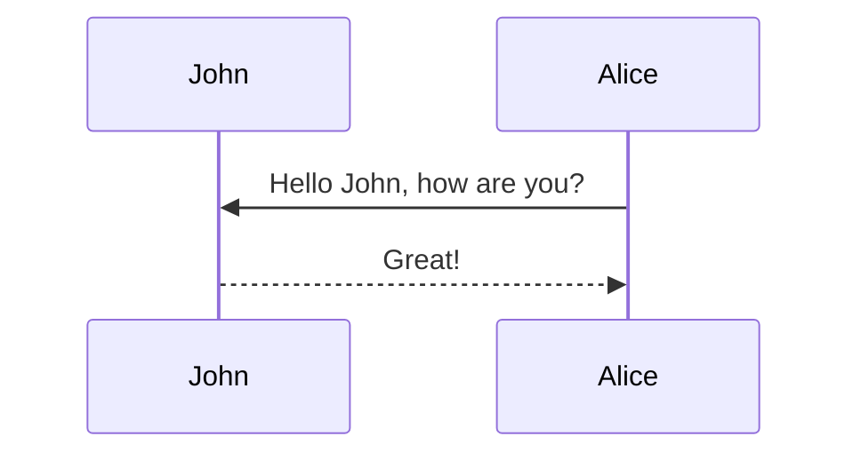

<h1 align="center">Diagram</h1>

## Mermaid

The diagram below was generated by the following code:

````markdown

````


<h1 align="center">Blockquotes</h1>

This post shows how to add custom styles for blockquotes. Based on [jekyll-gitbook](https://github.com/sighingnow/jekyll-gitbook) implementation.

We decided to support the same custom blockquotes as in [jekyll-gitbook](https://sighingnow.github.io/jekyll-gitbook/jekyll/2022-06-30-tips_warnings_dangers.html), which are also found in a lot of other sites' styles. The styles definitions can be found on the [\_base.scss](https://github.com/alshedivat/al-folio/blob/main/_sass/_base.scss) file, more specifically:

```scss
/* Tips, warnings, and dangers */
.post .post-content blockquote {
  &.block-tip {
    border-color: var(--global-tip-block);
    background-color: var(--global-tip-block-bg);

    p {
      color: var(--global-tip-block-text);
    }

    h1,
    h2,
    h3,
    h4,
    h5,
    h6 {
      color: var(--global-tip-block-title);
    }
  }

  &.block-warning {
    border-color: var(--global-warning-block);
    background-color: var(--global-warning-block-bg);

    p {
      color: var(--global-warning-block-text);
    }

    h1,
    h2,
    h3,
    h4,
    h5,
    h6 {
      color: var(--global-warning-block-title);
    }
  }

  &.block-danger {
    border-color: var(--global-danger-block);
    background-color: var(--global-danger-block-bg);

    p {
      color: var(--global-danger-block-text);
    }

    h1,
    h2,
    h3,
    h4,
    h5,
    h6 {
      color: var(--global-danger-block-title);
    }
  }
}
```

<hr>

### normal 

> This is a regular blockquote
> and it can be used as usual
>
> This is a list
> - one
> - two

### advenced

> ##### TIP
>
> A tip can be used when you want to give advice
> related to a certain content.
{: .block-tip }

> ##### WARNING
>
> This is a warning, and thus should
> be used when you want to warn the user
{: .block-warning }

> ##### DANGER
>
> This is a danger zone, and thus should
> be used carefully
{: .block-danger }

<hr>

<h1 align="center">List</h1>

## Hipster list

- brunch
- fixie
- raybans
- messenger bag

## Check List

- [x] Brush Teeth
- [ ] Put on socks
  - [x] Put on left sock
  - [ ] Put on right sock
- [x] Go to school

<h1 align="center">Maths</h1>

This theme supports rendering beautiful math in inline and display modes using [MathJax 3](https://www.mathjax.org/) engine. You just need to surround your math expression with `$$`, like `$$ E = mc^2 $$`. If you leave it inside a paragraph, it will produce an inline expression, just like $$ E = mc^2 $$.

To use display mode, again surround your expression with `$$` and place it as a separate paragraph. Here is an example:

$$
\sum_{k=1}^\infty |\langle x, e_k \rangle|^2 \leq \|x\|^2
$$

You can also use `\begin{equation}...\end{equation}` instead of `$$` for display mode math.
MathJax will automatically number equations:

\begin{equation}
\label{eq:cauchy-schwarz}
\left( \sum_{k=1}^n a_k b_k \right)^2 \leq \left( \sum_{k=1}^n a_k^2 \right) \left( \sum_{k=1}^n b_k^2 \right)
\end{equation}

and by adding `\label{...}` inside the equation environment, we can now refer to the equation using `\eqref`.

Note that MathJax 3 is [a major re-write of MathJax](https://docs.mathjax.org/en/latest/upgrading/whats-new-3.0.html) that brought a significant improvement to the loading and rendering speed, which is now [on par with KaTeX](http://www.intmath.com/cg5/katex-mathjax-comparison.php).


<h1 align="center">Codes</h1>

This theme implements a built-in Jekyll feature, the use of Rouge, for syntax highlighting.
It supports more than 100 languages.
This example is in C++.
All you have to do is wrap your code in markdown code tags:

````markdown
```c++
code code code
```
````

```c++
int main(int argc, char const \*argv[])
{
    string myString;

    cout << "input a string: ";
    getline(cin, myString);
    int length = myString.length();

    char charArray = new char * [length];

    charArray = myString;
    for(int i = 0; i < length; ++i){
        cout << charArray[i] << " ";
    }

    return 0;
}
```

For displaying code in a list item, you have to be aware of the indentation, as stated in [this FAQ](https://github.com/planetjekyll/quickrefs/blob/master/FAQ.md#q-how-can-i-get-backtick-fenced-code-blocks-eg--working-inside-lists-with-kramdown). You must indent your code by **(3 \* bullet_indent_level)** spaces. This is because kramdown (the markdown engine used by Jekyll) indentation for the code block in lists is determined by the column number of the first non-space character after the list item marker. For example:

````markdown
1. We can put fenced code blocks inside nested bullets, too.

   1. Like this:

      ```c
      printf("Hello, World!");
      ```

   2. The key is to indent your fenced block in the same line as the first character of the line.
````

Which displays:

1. We can put fenced code blocks inside nested bullets, too.

   1. Like this:

      ```c
      printf("Hello, World!");
      ```

   2. The key is to indent your fenced block in the same line as the first character of the line.

By default, it does not display line numbers. If you want to display line numbers for every code block, you can set `kramdown.syntax_highlighter_opts.block.line_numbers` to true in your `_config.yml` file.

If you want to display line numbers for a specific code block, all you have to do is wrap your code in a liquid tag:


 <br/> code code code <br/> 


The keyword `linenos` triggers display of line numbers.
Produces something like this:



int main(int argc, char const \*argv[])
{
string myString;

    cout << "input a string: ";
    getline(cin, myString);
    int length = myString.length();

    char charArray = new char * [length];

    charArray = myString;
    for(int i = 0; i < length; ++i){
        cout << charArray[i] << " ";
    }

    return 0;

}



<h1 align="center">Plotly Charts</h1>


This is an example post with some [plotly](https://plotly.com/javascript/) code.

````markdown
```plotly
{
  "data": [
    {
      "x": [1, 2, 3, 4],
      "y": [10, 15, 13, 17],
      "type": "scatter"
    },
    {
      "x": [1, 2, 3, 4],
      "y": [16, 5, 11, 9],
      "type": "scatter"
    }
  ]
}
```
````

Which generates:

```plotly
{
  "data": [
    {
      "x": [1, 2, 3, 4],
      "y": [10, 15, 13, 17],
      "type": "scatter"
    },
    {
      "x": [1, 2, 3, 4],
      "y": [16, 5, 11, 9],
      "type": "scatter"
    }
  ]
}
```

Also another example chart.

````markdown
```plotly
{
  "data": [
    {
      "x": [1, 2, 3, 4],
      "y": [10, 15, 13, 17],
      "mode": "markers"
    },
    {
      "x": [2, 3, 4, 5],
      "y": [16, 5, 11, 9],
      "mode": "lines"
    },
    {
      "x": [1, 2, 3, 4],
      "y": [12, 9, 15, 12],
      "mode": "lines+markers"
    }
  ],
  "layout": {
    "title": {
      "text": "Line and Scatter Plot"
    }
  }
}
```
````

This is how it looks like:

```plotly
{
  "data": [
    {
      "x": [1, 2, 3, 4],
      "y": [10, 15, 13, 17],
      "mode": "markers"
    },
    {
      "x": [2, 3, 4, 5],
      "y": [16, 5, 11, 9],
      "mode": "lines"
    },
    {
      "x": [1, 2, 3, 4],
      "y": [12, 9, 15, 12],
      "mode": "lines+markers"
    }
  ],
  "layout": {
    "title": {
      "text": "Line and Scatter Plot"
    }
  }
}
```


