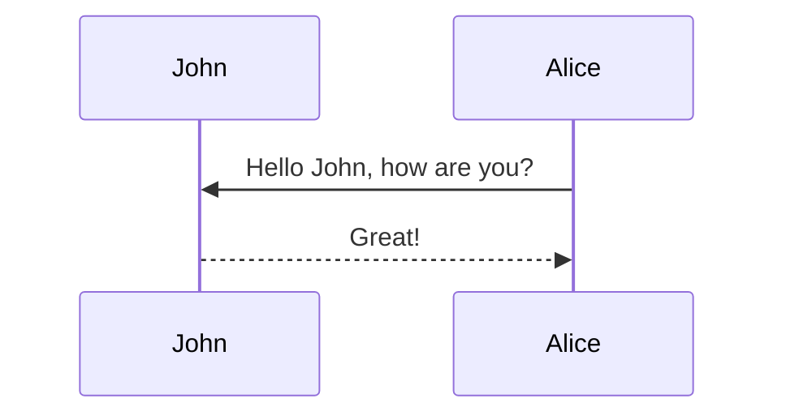

## Mermaid

The diagram below was generated by the following code:

````markdown

````


#### Hipster list

- brunch
- fixie
- raybans
- messenger bag

#### Check List

- [x] Brush Teeth
- [ ] Put on socks
  - [x] Put on left sock
  - [ ] Put on right sock
- [x] Go to school

<hr>

### normal 

> This is a regular blockquote
> and it can be used as usual
>
> This is a list
> - one
> - two

### advenced

> ##### TIP
>
> A tip can be used when you want to give advice
> related to a certain content.
{: .block-tip }

> ##### WARNING
>
> This is a warning, and thus should
> be used when you want to warn the user
{: .block-warning }

> ##### DANGER
>
> This is a danger zone, and thus should
> be used carefully
{: .block-danger }

<hr>

## Mermaid

The diagram below was generated by the following code:

````markdown

````


<hr>

The keyword `linenos` triggers display of line numbers.
Produces something like this:



int main(int argc, char const \*argv[])
{
string myString;

    cout << "input a string: ";
    getline(cin, myString);
    int length = myString.length();

    char charArray = new char * [length];

    charArray = myString;
    for(int i = 0; i < length; ++i){
        cout << charArray[i] << " ";
    }

    return 0;

}




```plotly
{
  "data": [
    {
      "x": [1, 2, 3, 4],
      "y": [10, 15, 13, 17],
      "mode": "markers"
    },
    {
      "x": [2, 3, 4, 5],
      "y": [16, 5, 11, 9],
      "mode": "lines"
    },
    {
      "x": [1, 2, 3, 4],
      "y": [12, 9, 15, 12],
      "mode": "lines+markers"
    }
  ],
  "layout": {
    "title": {
      "text": "Line and Scatter Plot"
    }
  }
}
```